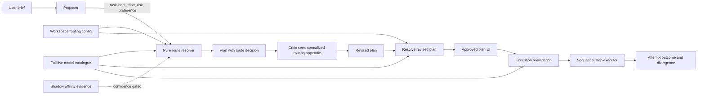
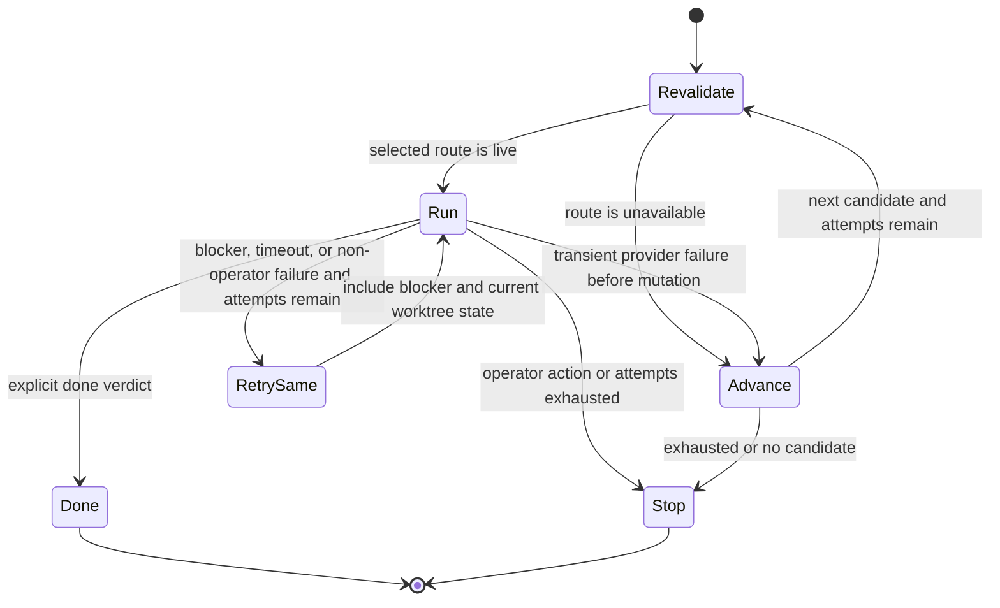

# Gigaplan intent-aware routing

**Status:** Implemented
**Prepared:** 2026-07-22
**Reference snapshot:** `code-yeongyu/oh-my-openagent@166d2e1ab549d06bd6be885cce54072fa5d5555c`
**Implementation estimate:** 5–7 engineering days, followed by one release of shadow evaluation

## Executive summary

Gigaplan already asks a proposer to assign each plan step to a CLI and model, but the assignment is prompt-driven, is not checked against the full live model catalogue, has no explicit fallback chain, and is not revalidated when execution begins. The execution RPC also reduces every provider to its first model before resolving an assignment. This makes the route brittle even when the plan itself is sound.

The useful pattern from Oh My OpenAgent is a layered routing pipeline: classify intent, resolve an ordered route from user preferences and defaults, confirm availability, and react to provider failures with bounded fallbacks. Gigaplan should adopt that architecture independently, while preserving its stronger plan-review loop and sequential shared-worktree execution.

The proposed design separates three concerns that Oh My OpenAgent's categories partly combine:

| Concern        | Gigaplan representation | Purpose                                                            |
| -------------- | ----------------------- | ------------------------------------------------------------------ |
| Work domain    | Existing `TaskKind`     | Frontend, backend, schema, tests, refactor, infra, docs, or review |
| Work depth     | New `RouteEffort`       | Quick, standard, or deep reasoning budget                          |
| Execution risk | New `RouteRisk`         | Low, medium, or high tolerance for automatic fallback              |

Each step receives a deterministic, explainable route before approval. The route is revalidated at execution, and only a narrowly classified pre-mutation infrastructure failure may advance to the next model. The existing three-attempt limit remains global per step, preventing a fallback chain from multiplying cost.

## Goals and non-goals

### Goals

| Goal                   | Measurable outcome                                                                                              |
| ---------------------- | --------------------------------------------------------------------------------------------------------------- |
| Deterministic routing  | The same step, policy version, configuration, and model catalogue resolve to the same ordered candidates        |
| Explainability         | The plan records why a model was selected, the policy version, and any execution-time divergence                |
| Availability safety    | A stale or unavailable exact model is never passed to a CLI                                                     |
| Bounded recovery       | Eligible provider failures can fall back, with no more than three total attempts per step                       |
| Evidence-led evolution | New affinity rules run in shadow mode and must pass checked-in routing evaluations before controlling execution |

### Non-goals

| Excluded from this project                        | Reason                                                                              |
| ------------------------------------------------- | ----------------------------------------------------------------------------------- |
| Parallel plan-step execution                      | Steps share one worktree and are intentionally sequential                           |
| Copying Oh My OpenAgent code or model tables      | Its Sustainable Use License requires an independent implementation for this product |
| Automatic affinity promotion in the first release | Current completion is mostly agent self-report and is too weak a quality signal     |
| Routing ordinary, non-Gigaplan conversations      | This change is scoped to plan construction and plan execution                       |
| Price optimization                                | The current model catalogue has no reliable normalized pricing metadata             |

## What to adopt from Oh My OpenAgent

The reference repository demonstrates four useful architectural ideas:

| Reference pattern                                 | Gigaplan adaptation                                                                       | Deliberate difference                                                               |
| ------------------------------------------------- | ----------------------------------------------------------------------------------------- | ----------------------------------------------------------------------------------- |
| Semantic categories carry model and prompt policy | `TaskKind`, effort, and risk feed a pure resolver                                         | Keep domain, depth, and risk orthogonal instead of creating mixed categories        |
| Ordered precedence and curated fallbacks          | User override → planner preference → evaluated affinity → policy profile → system default | Do not copy its exact model matrix; derive and test a Starbase-specific matrix      |
| Proactive model availability resolution           | Resolve only against the complete live `ModelsService.catalog`                            | Revalidate again immediately before execution                                       |
| Reactive provider-error fallback                  | Classify failures and advance through bounded alternatives                                | Never reroute after likely worktree mutation; preserve at-most-three total attempts |

Prompt rules based on procedural proxies such as “two or more steps” should not control routing. They encourage over-orchestration and are tracked as a problem in the reference project. Gigaplan should route from explicit work characteristics and runtime evidence instead.

## Current-state findings

| Finding                                                              | Impact                                                            | Required correction                                        |
| -------------------------------------------------------------------- | ----------------------------------------------------------------- | ---------------------------------------------------------- |
| `TaskKind` is recorded but does not affect model selection           | Domain intent is currently only a label                           | Feed it into a pure route resolver                         |
| The proposer emits an exact `agent: cli/model` from a prompt menu    | Selection is nondeterministic and hard to audit                   | Treat it as a preference, then normalize it through policy |
| `planAdversarial` does not pass the existing optional affinity input | Evidence displayed elsewhere cannot influence planning            | Replace the loose input with a typed routing context       |
| `planExecute` keeps only the first model for each CLI                | Valid assigned models disappear and stale selections survive      | Pass the complete live catalogue to execution              |
| Executor child `Failed` events are swallowed before verdict parsing  | An adapter failure with empty output can be interpreted as `done` | Capture failure events before adding any fallback behavior |

## Proposed architecture



The resolver belongs in `@starbase/core`. Prompt parsing and CLI failure classification remain in `@starbase/cli-adapters`. Desktop RPC supplies live catalogue and persisted configuration. UI displays and edits policy without owning routing logic.

## Domain contract

Add optional routing metadata so existing plans and transcripts continue to decode:

```ts
export type RouteEffort = "quick" | "standard" | "deep";
export type RouteRisk = "low" | "medium" | "high";

export interface RouteCandidate {
  readonly cli: CliName;
  readonly model: ModelId;
}

export interface RouteDecision extends RouteCandidate {
  readonly provenance:
    | "user-override"
    | "planner-preference"
    | "affinity"
    | "policy-profile"
    | "system-default";
  readonly reason: string;
  readonly policyVersion: string;
  readonly alternatives: ReadonlyArray<RouteCandidate>;
}

export interface PlanStepRouting {
  readonly effort: RouteEffort;
  readonly risk: RouteRisk;
  readonly decision: RouteDecision;
  readonly attempts?: ReadonlyArray<RouteAttempt>;
}
```

Keep `PlanStep.assignee` as the planner's preferred route for transcript compatibility. Add `PlanStep.routing?: PlanStepRouting` as the normalized decision. The UI must label these separately as “Planner preference” and “Will run on” when they differ.

Workspace configuration should be optional and use entries rather than a dynamic schema record:

```ts
export interface GigaplanRoutingConfig {
  readonly mode: "shadow" | "active";
  readonly overrides: ReadonlyArray<{
    readonly taskKind: TaskKind;
    readonly routes: ReadonlyArray<RouteCandidate>;
  }>;
}
```

`ConfigService.patch` must explicitly preserve this new section on unrelated settings writes. Absence means shadow mode with no overrides, preserving existing workspace files.

## Resolution policy

`resolvePlanRoutes(plan, context)` is total, side-effect free, and resolves each step using this precedence:

| Priority | Source                       | Eligibility rule                                                                                   |
| -------: | ---------------------------- | -------------------------------------------------------------------------------------------------- |
|        1 | Workspace task-kind override | Exact CLI/model exists in the live catalogue and CLI is installed                                  |
|        2 | Planner preference           | Exact emitted CLI/model is live and compatible with policy constraints                             |
|        3 | Runtime task-usage ranking   | A matching live model has a finite task score in the supplied OpenRouter usage snapshot             |
|        4 | Learned affinity             | Mode allows it, sample threshold is met, and confidence beats the configured margin                |
|        5 | Evaluated policy profile     | Checked-in `TaskKind × effort × risk` selectors produce live candidates                            |
|        6 | System default               | Configured orchestrator if live, otherwise the first stable candidate in canonical catalogue order |

Every ineligible candidate is skipped with a structured reason suitable for tests and diagnostics. Candidate order must never depend on object iteration, provider response timing, or localized display names.

In shadow mode, the resolver records what the semantic policy would select, but `decision` remains the legacy planner assignment after availability normalization and has no fallback alternatives. At execution time Shadow re-runs legacy route selection and legacy same-route retries; the counterfactual `shadowDecision` is never executable.

## Execution state machine



### Failure semantics

| Signal                                                                         | Classification                    | Action                                                  |
| ------------------------------------------------------------------------------ | --------------------------------- | ------------------------------------------------------- |
| Explicit `blocked:` executor verdict                                           | Task blocker                      | Retry the same route with blocker context               |
| Rate limit, transient network error, provider overload, missing deployed model | Reroutable infrastructure failure | Advance only if no mutation was observed                |
| Permission denial, missing credential, user decision, invalid plan             | Terminal operator action          | Stop and surface the exact cause                        |
| Tool or edit observed before adapter failure                                   | Possible partial mutation         | Retry the same route; never ask another model to repeat |
| Child `Failed` event with no final text                                        | Adapter failure                   | Classify and retry the same route unless operator-caused |

Count all runs—same-route retries and fallback runs—against the existing `MAX_STEP_ATTEMPTS = 3`. A retry prompt must instruct the model to inspect the current worktree before acting and include the prior blocker or provider failure.

## Implementation plan

### Phase 1 — Core policy and correctness foundation (1 day)

| File                                    | Change                                                                                                       |
| --------------------------------------- | ------------------------------------------------------------------------------------------------------------ |
| `packages/core/src/gigaplan-routing.ts` | Define schemas, policy context, stable candidate ordering, eligibility reasons, and pure route resolution    |
| `packages/core/src/conversation.ts`     | Add optional effort, risk, routing decision, and bounded attempt history                                     |
| `packages/core/src/plan-execution.ts`   | Resolve only exact live models and expose structured unavailability instead of accepting a stale model       |
| `apps/desktop/src/main/rpc.ts`          | Stop collapsing every provider to `models[0]`; supply the complete catalogue                                 |
| Core and RPC tests                      | Cover precedence, deterministic ordering, absent optional fields, stale routes, and full-catalog propagation |

Exit condition: a hand-built plan can be normalized into a stable, explainable route, and the selected exact model is guaranteed live.

### Phase 2 — Planning-loop integration (1 day)

| File                                                   | Change                                                                                                            |
| ------------------------------------------------------ | ----------------------------------------------------------------------------------------------------------------- |
| `packages/cli-adapters/src/adversarial-plan-prompt.ts` | Ask for `task`, `effort`, `risk`, and an optional model preference; define each token precisely                   |
| `packages/cli-adapters/src/adversarial-plan.ts`        | Resolve proposal routes before critique, resolve the revision again, and remove the underspecified affinity input |
| `packages/core/src/adversarial-plan.ts`                | Carry typed routing context and normalized plans through round results                                            |
| Plan formatting helper                                 | Append a generated routing appendix so the critic reviews normalized routes, not only raw proposer text           |
| Planning tests                                         | Prove malformed tokens get safe defaults, revisions reroute, and critic input contains route provenance           |

Exit condition: every newly approved step has domain, depth, risk, an eligible decision, alternatives, and a policy version.

### Phase 3 — Safe execution fallback (1–1.5 days)

| File                                                | Change                                                                                                                         |
| --------------------------------------------------- | ------------------------------------------------------------------------------------------------------------------------------ |
| `packages/cli-adapters/src/plan-executor.ts`        | Capture child `Failed` events, track whether a mutating tool/edit was observed, and implement the bounded route state machine  |
| `packages/cli-adapters/src/plan-executor-prompt.ts` | Add current-worktree inspection and prior-attempt context to retries                                                           |
| Failure classifier module                           | Normalize typed `CliExecError` and known provider messages into reroutable or terminal classes                                 |
| Plan persistence path                               | Persist actual candidate, outcome, failure reason, and divergence after each attempt                                           |
| Executor tests                                      | Cover empty-output failure, same-route blocker retry, pre-mutation fallback, post-mutation stop, and global attempt exhaustion |

Exit condition: an emitted child failure cannot count as success, and fallback cannot silently duplicate partially applied work.

### Phase 4 — Configuration and explainability UI (1–1.5 days)

| File                                               | Change                                                                                       |
| -------------------------------------------------- | -------------------------------------------------------------------------------------------- |
| `packages/core/src/domain.ts` and config service   | Add optional routing config and preserve it during every patch operation                     |
| Contracts, desktop RPC, and RPC client             | Add one typed command to save routing mode and ordered task-kind overrides                   |
| `packages/ui/src/composites/gigaplan-settings.tsx` | Add shadow/active mode and an advanced task-kind route editor using the live model catalogue |
| `packages/ui/src/composites/plan-assignee.tsx`     | Show resolved route, provenance, alternatives, and execution divergence                      |
| UI, RPC, and config tests                          | Cover reset, stale selections, legacy config, save preservation, and accessible route labels |

Exit condition: users can override policy without editing JSON and can see why the plan chose or changed a route.

### Phase 5 — Shadow evaluation and rollout (1–2 days)

| Work item              | Change                                                                                                                   |
| ---------------------- | ------------------------------------------------------------------------------------------------------------------------ |
| Routing scenario suite | Check in representative steps across all task kinds, efforts, risks, and catalogue shapes                                |
| Attempt evidence       | Persist and render route attempts locally; defer aggregate counters until a rollout consumer exists                     |
| Affinity scorer        | Compute candidate rankings in shadow only with minimum-sample and confidence gates                                       |
| Desktop E2E            | Exercise one semantic route, one unavailable-model normalization, and one safe provider fallback                         |
| Release gate           | Compare shadow decisions with legacy choices and promote only policies that pass the thresholds below                    |

Exit condition: active mode is supported by fixture tests and observed shadow results; affinity remains non-controlling until higher-quality outcome signals exist.

## Evaluation and release gates

Use an independently authored fixture set rather than encoding the reference project's model preferences. Pin every evaluated policy with `policyVersion` so historical plans remain explainable.

| Gate         | Threshold before active-by-default                                                                    |
| ------------ | ----------------------------------------------------------------------------------------------------- |
| Availability | 100% of selected routes exist in the supplied catalogue                                               |
| Determinism  | 100% repeatability for identical inputs across randomized map insertion order                         |
| Safety       | 100% of simulated post-mutation failures stop rather than reroute                                     |
| Recovery     | At least 95% of known transient pre-mutation provider errors advance correctly in classifier fixtures |
| Regression   | Existing legacy config/transcript fixtures and sequential executor tests remain green                 |

Roll out the correctness fixes—full catalogue use, stale-model rejection, and child-failure capture—immediately because they repair existing behavior. Ship semantic selection in shadow mode first. Promote it workspace-by-workspace after one release of evidence; preserve a visible switch back to normalized legacy assignment.

## Test strategy

| Layer                | High-value cases                                                                                    |
| -------------------- | --------------------------------------------------------------------------------------------------- |
| Schema and migration | Old plans decode; new route metadata round-trips; attempt history is bounded                        |
| Property tests       | Candidate order is stable; resolver always returns a live model or a typed no-route result          |
| Prompt and parser    | All task kinds, effort/risk defaults, malformed output, and routing appendix visibility             |
| Executor integration | Provider failure, blocker retry, mutation guard, model disappearance between planning and execution |
| Desktop/UI E2E       | Configure override → generate plan → inspect provenance → execute fallback → inspect divergence     |

Recommended commands during implementation:

```bash
pnpm --filter @starbase/core test
pnpm --filter @starbase/cli-adapters test
pnpm --filter @starbase/ui test
pnpm --filter @starbase/desktop test
pnpm typecheck
```

## Risks and mitigations

| Risk                                                  | Mitigation                                                                      |
| ----------------------------------------------------- | ------------------------------------------------------------------------------- |
| Model availability changes after plan approval        | Revalidate immediately before every attempt and record divergence               |
| Prompt preference conflicts with deterministic policy | Keep it above automatic usage/profile signals and preserve its provenance       |
| Automatic fallback repeats partial edits              | Change providers only before mutation; otherwise retry the same route           |
| Sparse self-reported outcomes bias affinity           | Shadow only, minimum samples, confidence margin, and future review/test signals |
| Config schema changes get dropped by unrelated saves  | Add round-trip and patch-preservation tests before exposing the settings UI     |

## Definition of done

| Requirement                                                                                                     | Verification                                |
| --------------------------------------------------------------------------------------------------------------- | ------------------------------------------- |
| Every new Gigaplan step has task kind, effort, risk, resolved route, reason, and policy version before approval | Planning integration tests and UI assertion |
| Exact stale models are never executed and the complete catalogue reaches resolution                             | Core property test and desktop RPC test     |
| Provider fallback is classified, mutation-safe, sequential, and limited to three total attempts                 | Executor state-machine tests                |
| Existing workspace config, plans, and transcripts still decode without migration                                | Backward-compatibility fixtures             |
| Users can inspect recommendation, actual route, and any divergence                                              | UI component tests and desktop E2E          |

## Delivery estimate

| Milestone                                   |   Estimate | Dependency                       |
| ------------------------------------------- | ---------: | -------------------------------- |
| Core resolver and current correctness fixes |      1 day | None                             |
| Planning integration                        |      1 day | Core resolver                    |
| Execution fallback and attempt persistence  | 1–1.5 days | Core route contract              |
| Settings and route explainability UI        | 1–1.5 days | Config and persistence contracts |
| Shadow evaluations and rollout controls     |   1–2 days | End-to-end route events          |

Total: 5–7 engineering days. Confidence-gated affinity controlling production routes is a follow-up of roughly 2–3 days after enough outcome data exists; it is intentionally not part of the first active rollout.

## Source notes

Research used the repository's current `dev` snapshot and focused on its category schema, model-resolution pipeline, fallback chains, runtime error classifier, provider-exhaustion policy, roadmap, and license. Relevant upstream files:

| Topic                       | Source                                                                                                                    |
| --------------------------- | ------------------------------------------------------------------------------------------------------------------------- |
| Category policy             | <https://github.com/code-yeongyu/oh-my-openagent/blob/dev/packages/omo-config-core/src/schema/category.ts>                |
| Resolution pipeline         | <https://github.com/code-yeongyu/oh-my-openagent/blob/dev/packages/model-core/src/model-resolution-pipeline.ts>           |
| Runtime fallback classifier | <https://github.com/code-yeongyu/oh-my-openagent/blob/dev/packages/model-core/src/runtime-fallback-error-classifier.ts>   |
| Provider exhaustion         | <https://github.com/code-yeongyu/oh-my-openagent/blob/dev/packages/model-core/src/provider-exhaustion-fallback-policy.ts> |
| License                     | <https://github.com/code-yeongyu/oh-my-openagent/blob/dev/LICENSE.md>                                                     |

The implementation must reproduce only general architectural ideas and independently authored policy/test data. No source, prompt text, category definitions, or curated model tables should be copied.
